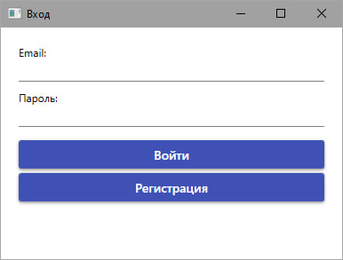
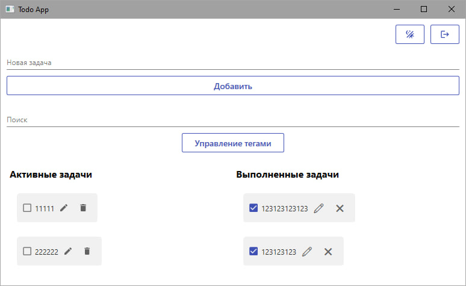

# TO-DO - Документация по проекту

## Содержание
1.1 [Описание проекта](#ProjectDescription)  
1.2 [Функциональные требования](#FunctionalRequirements)  
1.3 [Стек технологий](#TechStack)  
1.4 [Навигация между экранами](#Navigation)  
1.5 [Техническая документация](#TechnicalDocumentation)  

<a name="ProjectDescription"></a>
## 1.1 Описание проекта
**Наименование проекта**: Приложение для управления задачами с синхронизацией в облаке  

**Цель**: Разработка десктопного приложения (Todo-лист) с:  
- Синхронизацией между устройствами через Firebase  
- Поддержкой оффлайн-режима (SQLite)  
- Системой категорий и тегов  

<a name="FunctionalRequirements"></a>
## 1.2 Функциональные требования

### 1.2.1 Авторизация и синхронизация
- Вход через Google/Firebase Auth или email  
- Фоновая синхронизация при подключении к интернету  
- Локальное хранение данных в SQLite  

### 1.2.2 Управление задачами
- CRUD операции с задачами  
- Группировка по категориям/тегам  
- Поиск и фильтрация по:  
  - Названию задачи  
  - Тегам  
  - Статусу выполнения  

### 1.2.3 Напоминания
- Push-уведомления о предстоящих задачах  
- Настройка дедлайнов  

### 1.2.4 Интерфейс
- Адаптивный дизайн  
- Поддержка темной/светлой темы  

<a name="TechStack"></a>
## 1.3 Стек технологий
| Компонент | Технология |
|-----------|------------|
| Язык | C# (.NET 8) |
| UI Framework | WPF |
| Архитектура | MVVM (CommunityToolkit.MVVM) |
| Локальная БД | SQLite |
| Облачное хранилище | Cloud Firestore |
| Аутентификация | Firebase Auth |

<a name="Navigation"></a>
## 1.4 Навигация между экранами

- Окно входа 

  
  
- Окно задач 

  

# TO-DO CloudSave Application - Техническая документация

<a name="TechnicalDocumentation"></a>
## 1.5 Техническая документация по проекту

### 1.5.1 Класс CloudDataManager.cs
**Назначение**: Синхронизация данных между локальной SQLite базой и облачным Firestore

**Поля:**
| Поле | Тип | Описание |
|------|-----|----------|
| `_sqliteConnectionString` | string | Строка подключения к SQLite |
| `_firestoreDb` | FirestoreDb | Клиент Firestore |
| `_userId` | string | Идентификатор текущего пользователя |

**Методы:**
| Метод | Возвращаемое значение | Описание |
|-------|----------------------|----------|
| `SyncFromCloudAsync()` | Task<bool> | Основной метод синхронизации данных |
| `ClearLocalDatabaseAsync()` | Task | Очистка локальных таблиц |
| `LoadTagsFromCloudAsync()` | Task | Загрузка тегов из Firestore |
| `LoadTasksFromCloudAsync()` | Task | Загрузка задач из Firestore |
| `LoadTaskTagsFromCloudAsync()` | Task | Загрузка связей тегов и задач |

### 1.5.2 Класс DatabaseMigrator.cs
**Назначение**: Миграция данных из локальной SQLite в облачное Firestore хранилище

**Поля:**
| Поле | Тип | Описание |
|------|-----|----------|
| `_sqliteConnectionString` | string | Строка подключения к SQLite |
| `_firestoreDb` | FirestoreDb | Клиент Firestore |

**Методы:**
| Метод | Возвращаемое значение | Описание |
|-------|----------------------|----------|
| `MigrateToCloudAsync(string userId)` | Task<bool> | Основной метод миграции данных |
| `GetLocalDataAsync()` | Task<(List, List, List)> | Получение данных из SQLite |
| `ClearCloudCollectionsAsync(string userId)` | Task | Очистка коллекций в Firestore |
| `UploadDataToCloudAsync(string userId, ...)` | Task | Управление процессом загрузки данных |
| `UploadCollectionAsync(string userId, ...)` | Task | Пакетная загрузка коллекции в Firestore |

### 1.5.3 Класс DbRepository.cs
**Назначение**: Работа с локальной SQLite базой данных (CRUD операции)

**Методы работы с тегами:**
| Метод | Параметры | Возвращаемое значение |
|-------|-----------|----------------------|
| `AddTag` | string name | void |
| `RemoveTagById` | int id | void |
| `GetAllTags` | - | List<Tag> |

**Методы работы с задачами:**
| Метод | Параметры | Возвращаемое значение |
|-------|-----------|----------------------|
| `CreateTask` | Task task | void |
| `ToggleIsDone` | int taskId | void |
| `UpdateName` | int taskId, string name | void |
| `DeleteTask` | int taskId | void |

**Методы работы со связями:**
| Метод | Параметры | Возвращаемое значение |
|-------|-----------|----------------------|
| `AddTagToTask` | int taskId, int tagId | void |
| `RemoveTagFromTask` | int taskId, int tagId | void |
| `GetTasksByTag` | int tagId | List<Task> |

### 1.5.4 Схема базы данных SQLite
```sql
CREATE TABLE "Tags" (
    "id" INTEGER NOT NULL UNIQUE,
    "Name" TEXT NOT NULL UNIQUE,
    PRIMARY KEY("id")
);

CREATE TABLE "Tasks" (
    "id" INTEGER NOT NULL UNIQUE,
    "Name" TEXT NOT NULL,
    "Description" TEXT,
    "IsDone" INTEGER NOT NULL DEFAULT 0,
    "DeadLine" TEXT,
    PRIMARY KEY("id")
);

CREATE TABLE "TasksTag" (
    "TaskId" INTEGER NOT NULL,
    "TagId" INTEGER NOT NULL,
    PRIMARY KEY("TaskId","TagId")
);
```
